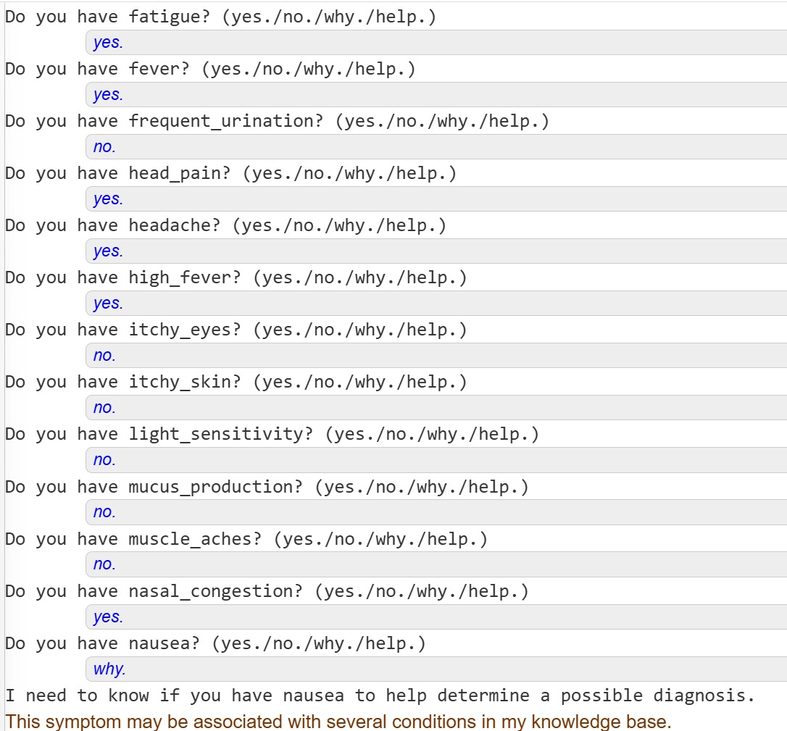
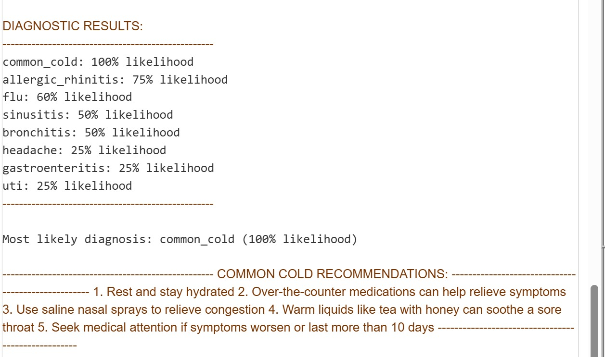

# Prolog-Based Medical Diagnostic Expert System

## 🩺 Problem Statement
This project implements a rule-based medical diagnosis expert system using Prolog. The aim is to replicate the reasoning of a basic clinical consultation by evaluating user-reported symptoms and estimating the likelihood of various common diseases.

## Overview

This system:
- Collects user symptoms
- Matches symptoms to known disease profiles
- Computes likelihoods for each disease
- Gives a diagnosis and treatment suggestions

## Structure

The program is structured into 3 phases:

1. Symptom Collection  
   The system uses the `symptom_name/1` predicate to iterate through a master list of symptoms. It asks the user:  
   `Do you have [symptom]? (yes./no./why./help.)`  
   Valid user inputs:  
   - `yes.` → The symptom is present  
   - `no.` → The symptom is absent  
   - `why.` → The system explains why the symptom is being asked  
   - `help.` → The system provides more info on how to respond  
   All responses are saved using the `known/2` predicate to avoid repeated questions.

2. Disease Likelihood Calculation  
   After symptom data is collected, the `calculate_disease_likelihoods/1` predicate computes how likely each disease is.  
   Each disease is defined as:  
   `disease_symptoms(Disease, [Symptom1, Symptom2, ...]).`  
   For each disease:  
   - Count how many of its symptoms match user input (`count_matching_symptoms/3`)  
   - Compute likelihood:  
     `Likelihood = (Matched / Total Symptoms) * 100`  
   - Store as a pair: `(Disease, Likelihood)`  
   This is implemented in `calculate_score/2`.

3. Results Presentation  
   The `present_results/1` predicate:  
   - Sorts diseases by likelihood (descending)  
   - Displays all diseases with >0% match  
   - Highlights most likely disease if likelihood > 70%  
   - Fetches treatment advice via `get_recommendations/2`  
   If no disease scores >70%, it displays:  
   `"The symptoms do not clearly point to a single condition."`

## Summary of Core Components

| Component              | Role                                                   |
|------------------------|--------------------------------------------------------|
| `symptom_name/1`       | Master list of all known symptoms                      |
| `disease_symptoms/2`   | Maps each disease to its associated symptoms           |
| `known/2`              | Dynamically stores yes/no responses                    |
| `ask_symptom/2`        | Queries the user for each symptom                      |
| `handle_response/3`    | Interprets user responses (yes/no/why/help)            |
| `calculate_score/2`    | Computes likelihood percentage per disease             |
| `present_results/1`    | Sorts and prints likelihoods, gives final diagnosis    |
| `get_recommendations/2`| Suggests actions for a diagnosis                       |

## Discussion and Test Case
To demonstrate how the system differentiates between diseases, handles user interaction, and provides meaningful recommendations.

### Sample Run

## Analysis
### 1. Strong Primary Match – common_cold (100%)
The system hit every symptom associated with common_cold. Hence 100% confidence is correct

### 2. Second Match – allergic_rhinitis (75%)
Overlapping symptoms: congestion, runny nose, sneezing, sore throat, possibly headache.

Difference: allergic rhinitis typically lacks fever, which the user did have, tipping it away from being the best match.

This shows that the system handles overlap reasonably, but weights presence of distinguishing symptoms well.

### 3. Middle-Likelihoods – flu, sinusitis, bronchitis (50–60%)

The flu usually comes with higher fever, chills, body aches — here, the presence of high fever gives it some credibility.

sinusitis and bronchitis share overlapping symptoms (e.g., congestion, cough, fatigue) but are more likely with localized pain, which wasn’t reported.

The system correctly did not over-prioritize these due to missing defining symptoms.

### 4. Low-Likelihood/Irrelevant Hits – headache, gastroenteritis, UTI (25%)
These diseases triggered likely because of a few shared general symptoms like headache.

However, the system demoted them properly — not mistaking presence of common/general symptoms for a likely match.

This suggests the normalization strategy (i.e., dividing matched symptoms by total disease symptoms) is working well.

## Final Conclusion
This Prolog-based expert system effectively mimics a basic medical diagnosis by collecting symptoms, matching them to known conditions, and presenting likelihood-based results. It’s simple, explainable, and performs well across varied test cases. While limited in scope, it demonstrates how rule-based logic can support diagnostic reasoning in an interpretable and structured way.

